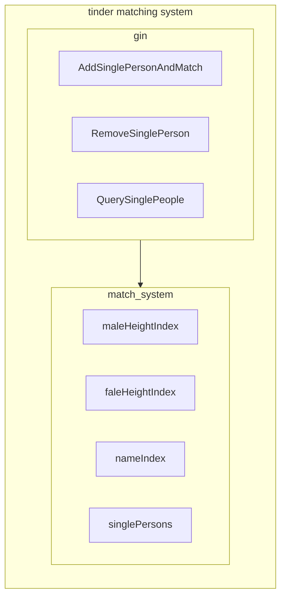
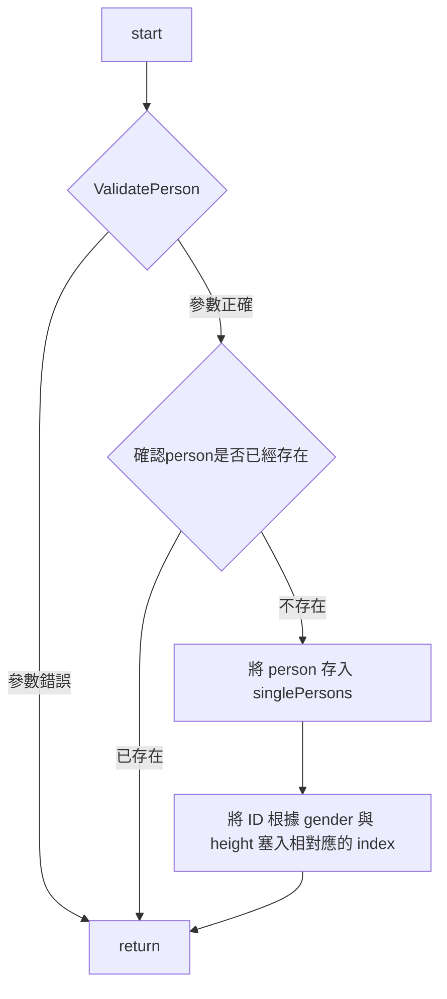
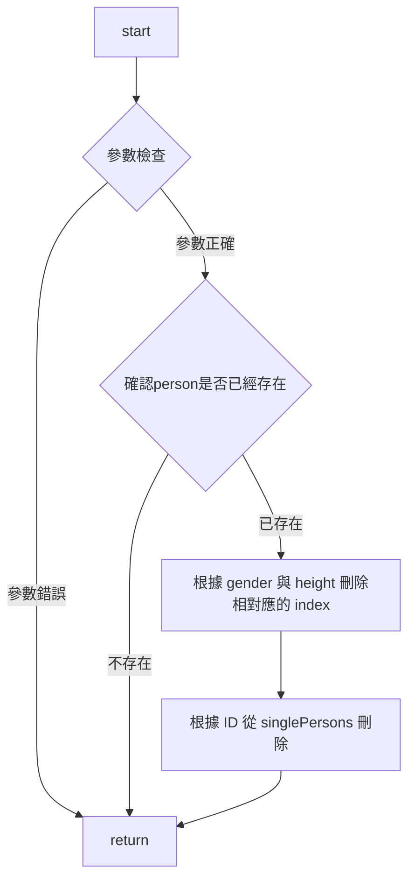
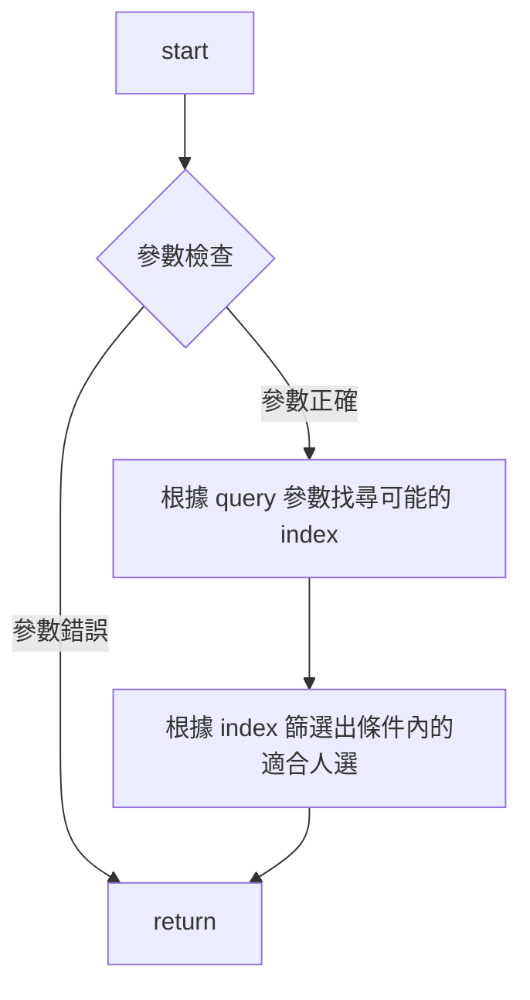

# Tender Matching System

## 系統架構圖

## 說明

主要透過 Gin 對外開放三隻 API 分別會是 AddSinglePersonAndMatch、RemoveSinglePerson 與 QuerySinglePeople，這三隻 API 收到 request 後會將參數整理後交由 match_system 進行後續處理。

match_system 本身將 user 資訊儲存與 singlePersons 在儲存與刪除 user 資訊時會同時異動 maleHeightIndex、faleHeightIndex 與 nameIndex。

其 match_system 相關作業皆都依賴於 maleHeightIndex、faleHeightIndex 與 nameIndex。

## API 時序圖與時間複雜度

### AddSinglePersonAndMatch




過程主要都是對 map 進行操作，golang map 操作平均時間複雜度為 O(1)，故整體時間複雜度為 O(1)

---

### RemoveSinglePerson



DeleteHeightIndex 的內容會針對 height 尋找相對應的 slice ，並將 id 從該 slice 刪除，這裡的時間複雜度會為 O(k)，k 為 slice 的長度，除此之外 RemoveSinglePerson 其餘操作皆為 O(1)，因此時間複雜度為 O(k)。

---

### QuerySinglePerson



QuerySinglePerson 的內容會針對 query 的條件尋找可能符合的 index ，再透過這些 index 做細部的篩選，FindHeightIdx 時間複雜度為 O(N * K) 其中 N 是 heightIndex 中的鍵值對數量，K 是每個切片的平均長度。

最後篩選出條件內的適合人選得部分會是 FindHeightIdx 的結果所以也是 O(N * K)，所以整個 API 時間複雜度為 O(N * K) 

---

# Generate API Doc
```
make doc
```

# Docker
```
make docker
docker run -p 8080:80 -d tinder_match_system  
```


